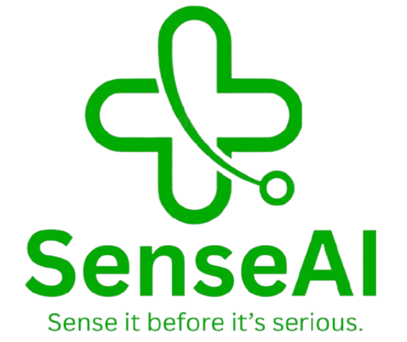
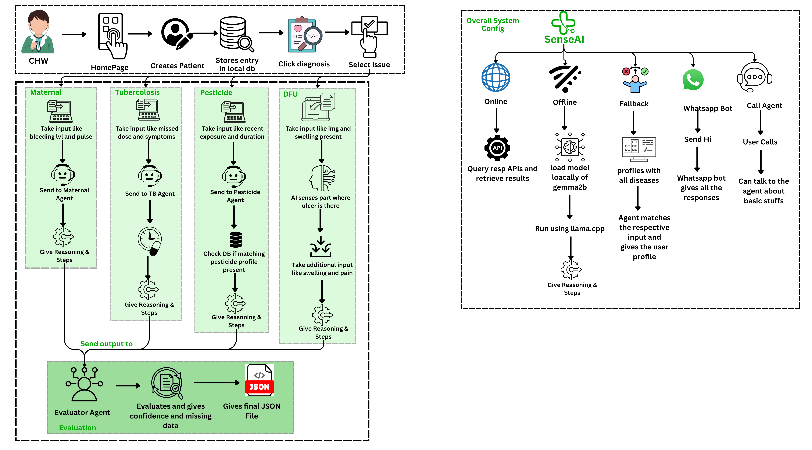

# SenseAI: Sense Before it's Serious

  

## Overview

SenseAI is an AI-driven healthcare assistant designed to support Community Health Workers (CHWs) and patients in rural and low-resource environments. The system provides real-time risk assessment, structured medical guidance, and multi-channel interaction through a Flutter mobile app, WhatsApp chatbot, and voice-based AI agent.

The platform focuses on early detection and triage of critical health conditions such as maternal hemorrhage, tuberculosis (TB) adherence, pesticide poisoning, and diabetic foot ulcers (DFU). It ensures accessibility even in low-connectivity regions by integrating both cloud-based APIs and offline AI models.

---

## Problem Statement

In rural areas, access to timely medical guidance is limited due to:

- Shortage of healthcare professionals
- Poor internet connectivity
- Lack of structured triage systems
- Delayed identification of high-risk conditions

This leads to preventable complications and increased mortality, especially in maternal health and chronic conditions.

---

## Our Solution

  

SenseAI provides a unified healthcare assistant that:

- Collects structured patient data step-by-step
- Performs AI-based risk assessment
- Generates actionable recommendations
- Supports multiple interaction channels (App, WhatsApp, Voice)
- Works both online and offline

The system acts as a first-level decision support tool, helping CHWs make faster and safer decisions.

---

## How It Works (Workflow)

| Step | Description |
|------|-------------|
| **Step 1 – Patient Selection** | User selects patient and condition from the app. |
| **Step 2 – Data Collection** | System collects structured inputs step-by-step. |
| **Step 3 – Online Processing** | If online: data is sent to backend API; AI agent processes and returns structured response. |
| **Step 4 – Offline Processing** | If offline: local Gemma model generates approximate reasoning; data is queued for sync. |
| **Step 5 – Output Delivery** | User receives risk score, risk level, recommendations, and checklist. |

---

## Agent-Based Architecture

SenseAI uses domain-specific agents for modular processing:

| Agent | Responsibility |
|-------|---------------|
| **Maternal Hemorrhage Agent** | Assesses hemorrhage risk and severity |
| **TB Adherence Agent** | Monitors tuberculosis medication adherence |
| **Pesticide Exposure Agent** | Evaluates exposure risk and urgency |
| **DFU Agent** | Analyses diabetic foot ulcer severity via image input |

---

## Key Features

### 1. Multi-Channel Access
- Flutter mobile application for CHWs
- WhatsApp chatbot for easy accessibility
- Voice AI agent for hands-free interaction

### 2. AI-Based Diagnosis System
- Domain-specific agents for Maternal Hemorrhage, TB Adherence, Pesticide Exposure, and DFU
- Structured scoring-based risk assessment (not random AI output)

### 3. Offline Functionality
- Uses lightweight Gemma model running locally on device
- Provides basic reasoning when internet is unavailable
- Automatically syncs data when connectivity is restored

### 4. Image-Based Analysis
- DFU detection using image input
- Evaluates wound severity and infection risk

### 5. Actionable Outputs
- Risk level classification: **LOW, MEDIUM, HIGH, CRITICAL**
- Step-by-step checklist for CHWs
- Clear explanation in simple language
- Missing data identification

### 6. Patient Management
- Store patient records locally
- Track diagnosis history
- Save checklist progress

---

## System Architecture

| Layer | Details |
|-------|---------|
| **Frontend** | Flutter mobile application |
| **Backend** | Flask-based API system (Python) |
| **AI & ML** | Prompt-engineered LLM agents, Gemma 2B (quantized GGUF for offline inference) |
| **Communication** | WhatsApp Cloud API, ElevenLabs Voice AI |
| **Storage** | Local storage for offline support, sync queue for delayed API calls |

---

## Tech Stack

| Layer | Technologies |
|-------|-------------|
| **Frontend** | Flutter |
| **Backend** | Flask (Python) |
| **AI & ML** | LLM-based prompt engineering, Gemma 2B (quantized GGUF) |
| **APIs & Integrations** | WhatsApp Cloud API, ElevenLabs Voice AI, REST APIs |
| **Storage** | Local storage, Sync queue |

---

## Implementation Screenshots

  

---

### ✅ Completed
- Multi-channel access (App, WhatsApp, Voice)
- Domain-specific AI agents for 4 critical conditions
- Structured scoring-based risk assessment
- Offline AI inference with Gemma 2B
- Image-based DFU analysis
- Patient record management and history tracking
- Risk level classification with actionable checklists

### 🔮 Future Enhancements
- Integration with government health systems
- Multi-language voice support expansion
- Advanced image analysis models
- Integrate better call agents

---

## Innovation

- **Hybrid AI System** – Seamless online/offline operation
- **Clinical-Style Scoring** – Reliable structured outputs instead of random AI responses
- **Multi-Platform Accessibility** – App + Chat + Voice in one platform
- **Rural-First Design** – Built specifically for low-connectivity, low-resource environments
- **Lightweight On-Device Inference** – Gemma 2B runs locally without internet

---

## Use Cases

- Community Health Workers in villages
- Primary health centers
- Remote patient monitoring
- Emergency triage support
- Health awareness and guidance

---

## Impact

SenseAI aims to:

- Reduce delay in identifying critical cases
- Empower CHWs with decision support tools
- Improve rural healthcare accessibility
- Provide scalable and cost-effective healthcare assistance

---

## Limitations

- Not a replacement for professional medical diagnosis
- Offline model has lower accuracy compared to cloud AI
- Image-based analysis depends on image quality

---

## Disclaimer

This system provides general medical guidance and risk assessment. It is not a substitute for professional medical advice, diagnosis, or treatment. Always consult a qualified healthcare provider for medical concerns.

---

**Built with ❤️ Team INSPIRE**
